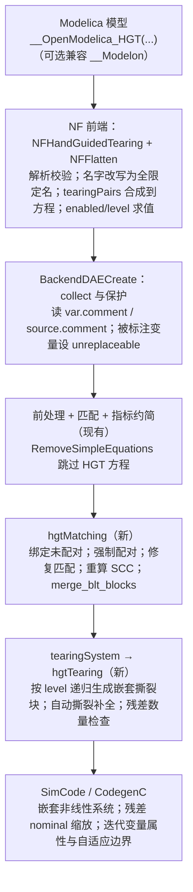

# OpenModelica 手动引导撕裂（HGT）实现方案

2026-10-06 · 第 2 版：按 OCT 官方用户手册修订

依据：*OPTIMICA Compiler Toolkit User's Guide, Version 1.44*，第 14 章 "Steady-state Modelica Modeling with Hand Guided Tearing"（印刷页 169–183）、附录 B 编译选项（221–223）、第 20 章限制（203）。下文 "p. N" 均指该手册的印刷页码。

## 1. 背景与目标

在 OpenModelica 中实现与 OCT 一一对应的 HGT 注解和编译选项，第一期只做旧后端（`BackEnd/`）。

- 目标 1：注解语法与 OCT 逐字段对应。OCT 模型只需把 `__Modelon(` 换成 `__OpenModelica_HGT(`，开启兼容开关后甚至不用改。
- 目标 2：旧后端支持 OCT 的全部用法：组件级配对、系统级配对、未配对、`level` 嵌套撕裂、迭代变量属性（含自适应边界）。
- 目标 3：编译选项与 OCT 对应：`hand_guided_tearing`、`merge_blt_blocks`、`allow_multiple_residuals_in_hgt_blocks`。
- 目标 4：适用范围与 OCT 对齐，OMC 的 HGT 也只保证稳态（见 §3.3）。
- 不在第一期：新后端（`NBackEnd/`）；`hold`（参数化保持）的运行时支持，第一期只解析不生效；`for` 循环与数组方程中的注解。

## 2. OCT 官方规范要点

### 2.1 注解

| 写在哪里 | OCT 语法 | 字段（默认值） | 出处 |
| --- | --- | --- | --- |
| 方程 | `__Modelon(name=IDENT)` | 方程名，供系统级配对引用 | p. 169 |
| 方程（组件级配对） | `__Modelon(ResidualEquation(iterationVariable(...)=x, ...))` | `enabled`(true)、`level`(1, ≥1)、`nominal`(1)、`hold`(false)、`iterationVariable` | p. 170 |
| 方程（未配对残差） | `__Modelon(ResidualEquation)` 或省略 `iterationVariable` 的 `ResidualEquation(...)` | 同上，但不写 `iterationVariable` | p. 173 |
| 变量（未配对迭代变量） | `__Modelon(IterationVariable)` 或 `IterationVariable(...)` | `enabled`(true)、`level`(1)、`max`、`min`、`nominal`、`start`、`hold`(false) | p. 173 |
| 类（系统级配对） | `__Modelon(tearingPairs(Pair(...), ...))` | `Pair`：`enabled`(true)、`level`(1)、`residualEquation(nominal=1, hold=false)=<方程名路径>`、`iterationVariable(...)=<变量路径>` | p. 171 |

`iterationVariable` 和 `residualEquation` 用"带修饰的赋值"形式，例如 `iterationVariable(start=1, nominal=10, hold=h)=q`。它的属性字段为 `max`、`min`、`nominal`、`start`、`hold`。`name` 可以和 `ResidualEquation` 写在同一个 `__Modelon(...)` 里，例如 `__Modelon(ResidualEquation, name=dx)`（p. 158）。

### 2.2 语义规则

| 编号 | 规则 | 出处 |
| --- | --- | --- |
| R1 | 配对在自动撕裂之前撕开，且不考虑可解性；配对给多了也全部使用，撕裂块会变得不必要地复杂 | p. 169 |
| R2 | 所有配对撕开后系统仍不可解时，由自动撕裂补全 | p. 169 |
| R3 | 组件级配对要求方程能"看见"迭代变量（同一名字作用域） | p. 170 |
| R4 | 方程与变量不在同一作用域时，用系统级 `tearingPairs`，方程通过 `name` 引用 | p. 171 |
| R5 | 未配对的方程和变量由编译器配对；两者数量不等时报错 | p. 172 |
| R6 | `level` 相同的方程和变量撕进同一个块；不同 `level` 形成嵌套撕裂块 | p. 174 |
| R7 | `max/min/start/nominal` 可省略，省略时取变量声明的属性；表达式中可以引用连续变量，但该变量必须在块求解开始前已经算出，且块的 `level` ≥ 2（"自适应边界"） | p. 174 |
| R8 | `merge_blt_blocks=true`（默认 false）：所有 level 1 配对和所有未配对 HGT 放进同一个 BLT 块 | p. 221 |
| R9 | `allow_multiple_residuals_in_hgt_blocks`（默认 `'level1'`）：`'false'` 所有 HGT 块只能有一个残差；`'level1'` 只有 level 1 块可以有多个残差；`'true'` 不检查 | p. 223 |
| R10 | `hold`：把迭代变量或残差绑定到布尔参数，为 true 时在交互式 FMU 的稳态求解器（FMUProblem）中被"保持"，即不参与求解 | pp. 107, 125 |
| R11 | HGT 只支持稳态仿真；用于动态仿真未经测试，行为未定义 | p. 203 |

手册没有写的两点，本方案按推断处理，并在第 12 节列为待确认：

- `merge_blt_blocks=false` 时，跨 BLT 块的配对如何处理。
- 编译器怎样给未配对的方程和变量配对。

### 2.3 官方示例

方案的测试用例按这些示例的结构编写：

- `NonConvex` / `NonConvexNHGT`（p. 175–177）：两层嵌套，level 2 给定 x1 求 x2，level 1 求 x1。
- `Test`（p. 179–182）：两层嵌套，并在 level 2 用 `iterationVariable(max=20-x1)=x2` 设置自适应边界。
- `twoEqSteadyStateParaHold`（p. 125）：`hold` 与 `name` 和 `ResidualEquation` 写在一起。
- `TestUnpaired`（p. 158）：组件之间的未配对迭代变量和残差，配合 `merge_blt_blocks=true` 使用。
- 系统级 `tearingPairs` 示例（p. 172）。

## 3. OMC 注解与选项设计

### 3.1 注解：一个容器注解，内部语法与 OCT 完全相同

OCT 把 `name`、`ResidualEquation`、`IterationVariable`、`tearingPairs` 都放在同一个 `__Modelon(...)` 里，并且有 `name` 与 `ResidualEquation` 并列的写法。所以 OMC 用一个容器注解 `__OpenModelica_HGT(...)`，括号内的语法、字段名和默认值与 OCT 逐字相同：

| OCT | OMC |
| --- | --- |
| `x = y + 1 annotation(__Modelon(name=res));` | `x = y + 1 annotation(__OpenModelica_HGT(name=res));` |
| `__Modelon(ResidualEquation(iterationVariable(start=1, nominal=10, hold=h)=q, nominal=100, hold=h))` | `__OpenModelica_HGT(ResidualEquation(iterationVariable(start=1, nominal=10, hold=h)=q, nominal=100, hold=h))` |
| `__Modelon(ResidualEquation, name=dx)` | `__OpenModelica_HGT(ResidualEquation, name=dx)` |
| `Real x annotation(__Modelon(IterationVariable(enabled=true)));` | `Real x annotation(__OpenModelica_HGT(IterationVariable(enabled=true)));` |
| `annotation(__Modelon(tearingPairs(Pair(residualEquation=b.res, iterationVariable=c.z))));` | `annotation(__OpenModelica_HGT(tearingPairs(Pair(residualEquation=b.res, iterationVariable=c.z))));` |

这和第 1 版方案不同：第 1 版设计的是 4 个独立的 `__OpenModelica_*` 注解。改用容器后，OCT 模型的迁移就是机械替换。

兼容开关 `--acceptModelonHGT`：同时识别 `__Modelon(...)` 中的 HGT 子集，`__Modelon` 里与 HGT 无关的内容一律忽略。

### 3.2 编译选项

| OCT 选项（默认值） | OMC 选项（默认值） | 说明 |
| --- | --- | --- |
| `hand_guided_tearing`（false） | `--handGuidedTearing`（false） | 总开关；关闭时注解只做语法检查 |
| `merge_blt_blocks`（false） | `--hgtMergeBLTBlocks`（false） | R8 |
| `allow_multiple_residuals_in_hgt_blocks`（'level1'） | `--hgtAllowMultipleResiduals=false\|level1\|true`（level1） | R9 |
| `automatic_tearing`（true） | 不新增，对应现有 `--tearingMethod` | 关闭自动撕裂相当于 `minimalTearing` |
| `interactive_fmu` 等 | 不实现 | OMC 没有交互式 FMU |

### 3.3 适用范围：只保证稳态（与 OCT 对齐）

OCT 手册写明 HGT 只支持稳态仿真，用于其他仿真"未经测试，行为未定义"（R11）。OMC 采用同样的承诺。

- **稳态模型的判定**：指标约简后模拟系统中没有连续状态变量（`BackendDAE` 中不存在 `STATE` 类变量），即每一步都只解代数方程组。
- **稳态模型**：HGT 在模拟系统和初始化系统中都生效，两者都是代数求解。这是唯一保证正确、纳入测试的场景。
- **非稳态模型**（存在连续状态）：照 OCT 的做法仍然应用 HGT，不报错；但只发出一次警告："Hand guided tearing is only supported for steady-state models; use with dynamic models is untested and has undefined behavior."，不做专门测试，也不承诺行为。
- 用户文档和 `--handGuidedTearing` 的选项说明都写明这一限制。

这样也收窄了实现范围。稳态模型没有状态，也就不发生指标约简和 dummy derivative 选择，所以第 1 版方案里"强制配对与指标约简冲突"的问题在保证范围内不存在。

## 4. 与第 1 版方案相比的修订

| 主题 | 第 1 版 | 第 2 版（依据） |
| --- | --- | --- |
| 注解形式 | 4 个独立的 `__OpenModelica_*` | 容器 `__OpenModelica_HGT(...)`，内部与 OCT 相同（§2.1） |
| `level` | 未涉及 | 支持嵌套撕裂块；旧后端需新增嵌套内部块的表示（R6） |
| 迭代变量属性 | 只有残差 `nominal` | `max/min/nominal/start`，含 level ≥ 2 的自适应表达式（R7） |
| `hold` | 未涉及 | 第一期解析、校验并给出"未支持"警告；运行时放到后续（R10） |
| 未配对数量不等 | 由自动撕裂补足 | 报错（R5） |
| 配对撕开后仍不可解 | 默认报错 | 由自动撕裂补全；配对过多也全部使用（R1、R2） |
| `merge_blt_blocks` | 理解为"是否允许跨 SCC 合并"，默认 true | 默认 false；true 表示把所有 level 1 配对和未配对放进同一个块（R8） |
| 残差数量限制 | 未涉及 | 新增 `--hgtAllowMultipleResiduals`（R9） |
| 适用范围 | 未说明 | 与 OCT 对齐，只保证稳态模型；非稳态模型照常应用但给出"行为未定义"警告（R11，§3.3） |

## 5. 现状调研

路径相对 `OMCompiler/Compiler/`，行号对应 `master`（`d344fec3`）。

| 已有能力 | 位置 | 用处 |
| --- | --- | --- |
| 变量注解 `__OpenModelica_tearingSelect` 的解析 | `NFFrontEnd/NFBackendExtension.mo:1574` | 注解解析的参照写法 |
| `userDefinedTearing`（`--setTearingVars`/`--setResidualEqns`） | `BackEnd/Tearing.mo:5444` | 给定迭代变量和残差后做因果化 |
| `CellierTearing(..., tearingSelect_always, ...)` | `BackEnd/Tearing.mo:214` | "强制迭代变量 + 自动补全" |
| `callTearingMethod` 按 SCC 选择撕裂方法 | `BackEnd/Tearing.mo:170` | HGT 入口 |
| `strongComponentsScalar` / `Sorting.Tarjan` | `BackEnd/BackendDAETransform.mo:80`、`BackEnd/Sorting.mo:50` | 强制匹配后重算 SCC |
| 撕裂结果 `TEARINGSET.innerEquations`（`INNEREQUATION(eqn, vars)`） | `BackEnd/BackendDAE.mo:607–629` | **只能是扁平的单方程，不能嵌套块**；level ≥ 2 需要扩展 |
| 撕裂系统转 SimCode | `SimCode/SimCodeUtil.mo:3744` `createTornSystem`、`:4013` `createTornSystemInnerEqns` | 嵌套块要在这里递归生成 |
| 非线性系统内部生成嵌套非线性系统的残差函数 | `Template/CodegenC.tpl:3150`（`innerNLSSystems`） | **代码生成已有嵌套路径**，可复用 |
| 非线性系统的 min/max/nominal 只在 `initializeStaticDataNLS` 中算一次 | `Template/CodegenC.tpl:3506–3527` | 自适应边界需要新增"每次求解前更新"的函数 |

注解在编译链路中的可见性：

- 变量：`BackendDAE.VAR.comment`（`BackEnd/BackendDAE.mo:268`）保留了注解，后端可以直接读。
- 方程：NF 把方程注释存进 `ElementSource.comment`（`NFFrontEnd/NFInst.mo:3660`），能传到旧后端。但 `instance` 是 `NOCOMPPRE()`，所以相对名字必须由前端改写成全限定名。
- 类：子组件所属类上的 `tearingPairs` 不会进入 DAE，只能由前端收集。

## 6. 总体架构

## 7. 前端（NF）

### 7.1 职责与输出

前端把 `__OpenModelica_HGT(...)`（以及 `--acceptModelonHGT` 时的 `__Modelon(...)` 的 HGT 子集）解析成一份名字已解析、全部用全限定名的 HGT 清单。旧后端只用这份清单，不再接触原始注解。

1. **方程身份标签**：每条与 HGT 有关的方程，在 `ElementSource.comment` 中追加一个内部标签（`ElementSource.addCommentToSource`），写上它的全限定方程名，如 `a.b.res`。没写 `name` 的残差方程由前端生成名字，如 `$hgt_eq_3`。用户原注释保持不变。
2. **结构化清单**：作为新的 DAE 元素 `DAE.Element.HAND_GUIDED_TEARING(spec)` 交给后端，内容为：
   - 配对：方程名、迭代变量（`DAE.ComponentRef`）、`level`、残差 `nominal`、迭代变量的 `start/min/max/nominal`（`DAE.Exp`）、`hold`。
   - 未配对残差、未配对迭代变量，各自带 `level` 与属性。
   - 源码位置，供报错使用。

**已确认的决定：用新的 DAE 元素传递清单**。属性表达式（如 `max=20-x1`）需要以 `DAE.Exp` 进入代码生成，而只有 NF 有 `Expression.toDAE`；只改写注释里的名字做不到这一点。用专门 DAE 元素传递信息也有先例：Optimica 的 `DAE.CONSTRAINT` / `DAE.CLASS_ATTRIBUTES` 就是这样交给 `BackendDAECreate` 的（`BackEnd/BackendDAECreate.mo:989`）。

### 7.2 为什么放在展平阶段

名字解析需要注解所在的作用域，加全名需要组件前缀，NF 只在展平时同时拥有两者：

- 每条方程带 `eq.scope`，`flattenEquation(eq, prefix, …)`（`NFFrontEnd/NFFlatten.mo:1856`）同时拿到前缀。
- 变量查找：`Lookup.lookupComponent(Absyn cref, scope, …)`（`NFFrontEnd/NFLookup.mo:115`），即 R3 的"方程能看见变量"。
- 加前缀：`flattenCref`，即 `Prefix.apply`（`NFFrontEnd/NFFlatten.mo:1681`）。
- 表达式：`Inst.instExp` → `Typing.typeExp` → `flattenExp`。`enabled`、`level` 用 `Ceval.evalExp` 编译期求值。

风险：展平阶段调用类型检查不是 NF 的惯常做法。此时所有组件已完成类型检查，理论上可行；不行时的退路是在 `NFTyping` 阶段先做查找和类型检查并暂存，展平时只加前缀。

### 7.3 各类注解的处理

| 注解 | 读取位置 | 前端动作 |
| --- | --- | --- |
| 方程上的 `name=res` | `flattenEquation`，读 `source.comment` | 加前缀得全名，登记到方程名表；同一作用域重名报错 |
| 方程上的 `ResidualEquation(iterationVariable(...)=x, level, nominal, hold, enabled)` | 同上 | 在 `eq.scope` 中查 x 并加前缀；属性表达式实例化、类型检查、展平；求值 `enabled`/`level`；记为配对。不写 `iterationVariable` 时记为未配对残差 |
| 变量上的 `IterationVariable(...)` | `flattenSimpleComponent`（`NFFlatten.mo:741` 一带） | 变量全名即展平名；属性在组件所在作用域解析；记为未配对迭代变量 |
| 类上的 `tearingPairs(Pair(...))` | 展平每个组件时读其类定义的注释；顶层类在 `flatten()` 中读 | `residualEquation=b.res` 加前缀成方程全名；`iterationVariable(...)=c.z` 在类作用域查找并加前缀；方程名先挂起，展平结束后统一核对 |

**已确认的决定：类上的 `tearingPairs` 不继承**。只读取组件实际类的定义注释，不沿 `extends` 收集基类上的 `tearingPairs`，与 Modelica 类注解一般不继承的惯例一致。基类中方程和变量上的注解照常生效，因为它们随方程和变量一起被继承。

**展平收尾**（`flatten()` 末尾）：

- 核对挂起的系统级配对，方程名不存在则报错。
- 把系统级配对合并到对应方程上，同一方程被配对两次则报错。
- 把清单放进 `FlatModel` 的新字段（`FLAT_MODEL` 只有 3 处构造）。
- `NFConvertDAE` 把清单转成 `DAE.Element.HAND_GUIDED_TEARING`，表达式转为 `DAE.Exp`。

### 7.4 多个 `annotation` 子句

**已确认的决定：支持同一个类里写多个 `annotation` 子句**（OCT 示例 p. 172 就是这样写的）。

- 语法层面 OMC 已经允许（`Parser/Modelica.g` 第 565、1056 行）。
- 但 `AbsynToSCode.translateCommentList` 会用 `AbsynUtil.mergeAnnotationsList` 把它们合并成一个（`FrontEnd/AbsynToSCode.mo:1489`），同名子修饰会被覆盖，后一个 `tearingPairs` 会冲掉前一个。
- 改动：在 `translateCommentList` 中对 `__OpenModelica_HGT` / `__Modelon` 特殊处理，把多个子句中的 `tearingPairs(...)` 参数拼接起来，其余注解仍按原规则合并。
- 用测试确认：同一个 `tearingPairs` 里的多个 `Pair(...)` 在 SCode 中不会被去重。

### 7.5 校验与限制

前端报错的情况：

- 字段名未知或类型不对。
- `iterationVariable` 查不到，或引用了离散变量。
- `level` < 1，或不能在编译期求值。
- level 1 的属性表达式引用了连续变量（R7）。
- 系统级配对引用的方程名不存在或重名。
- 同一变量或方程被重复标注。

其他规则：

- **未配对数量是否相等（R5）**：在后端按 level 检查，前端看不到最终保留的方程。
- **第一期不支持**（警告并忽略）：`for` 循环中的方程（展开后同名冲突）、数组方程。
- **组件数组**（`Sub a[3]`）：按标量展开后前缀带下标，名字为 `a[2].res`，可以支持。
- **展平后的检查**：NF 后续的化简、标量化、常量求值可能删除或拆分已标注的方程。交给 `NFConvertDAE` 前检查：每个已登记方程名恰好出现一次。
- **开关**：`--handGuidedTearing=false` 时仍做语法检查，检测到注解时提示一次"HGT 未开启"，不生成清单。`--acceptModelonHGT` 让前端按同样规则处理 `__Modelon(...)` 的 HGT 子集。

### 7.6 改动文件与测试

| 文件 | 改动 |
| --- | --- |
| `NFFrontEnd/NFHandGuidedTearing.mo`（新增） | 数据结构、注解解析、名字解析、收尾核对、转 DAE；约 600–800 行 |
| `NFFrontEnd/NFFlatten.mo` | `flatten`、`flattenEquation`、`flattenSimpleComponent`、组件类处理处的钩子 |
| `NFFrontEnd/NFFlatModel.mo` | 清单字段 |
| `NFFrontEnd/NFConvertDAE.mo` | 输出新 DAE 元素 |
| `FrontEnd/DAE.mo`，及 `DAEDump`、`DAEUtil` 中需穷举的 `match` | 新增 `DAE.Element.HAND_GUIDED_TEARING` |
| `FrontEnd/AbsynToSCode.mo` | 多个 `annotation` 子句中 `tearingPairs` 拼接 |
| `Util/Flags.mo`、`Util/Error.mo` | 开关、调试标志 `-d=hgtDump`、约 10 条错误信息 |

前端可单独测试：`-d=hgtDump` 在展平后打印解析好的清单，测试对比这份输出，不依赖后端。覆盖：

- 组件级配对。
- 系统级配对，含多个 `annotation` 子句。
- 未配对残差与迭代变量。
- `level`、属性表达式、参数形式的 `enabled`。
- 组件数组。
- 基类上的 `tearingPairs` 不生效。
- 各类错误。
- `__Modelon` 兼容。

预计 1–1.5 周（含测试）。

## 8. 旧后端：数据收集与保护

新文件 `BackEnd/HandGuidedTearing.mo`：

- **`collect(EqSystem)`** 生成三张表：
  - 配对：(变量, 方程, level, 变量属性, 残差 nominal)。
  - 未配对迭代变量：按 level 分组，附带属性。
  - 未配对残差：按 level 分组，附带 nominal。

  按名字匹配，所以模拟系统和初始化系统各算各的。
- **只认原方程**：指标约简微分出的副本（`EquationAttributes.differentiated = true`）会继承原方程的注释，但不作为 HGT 方程。
- **防止被优化掉**：
  - 被标注的变量在 `BackendDAECreate` 中设 `unreplaceable = true`。
  - `RemoveSimpleEquations` 跳过 HGT 方程。OCT 也修过同类问题："linear equation elimination broke HGT equations"（附录 E.44）。
- **合法性检查**（新增错误号放在 `Util/Error.mo`）：

| 情况 | 处理 |
| --- | --- |
| 某个 level 上未配对方程数 ≠ 未配对变量数 | 错误（R5） |
| 迭代变量是离散变量 | 错误 |
| 迭代变量同时标了 `__OpenModelica_tearingSelect = never` | 错误 |
| 同一变量被配对或标注多次 | 错误 |
| 被引用的方程或变量不存在，或已被优化掉 | 错误 |
| 迭代变量在本系统里不是未知量（状态、参数） | 警告并忽略 |
| level ≥ 2 的属性表达式引用的变量没有在块前算出 | 错误（R7） |
| level 1 的属性表达式引用了连续变量 | 错误（R7） |
| 模型含连续状态（非稳态） | 警告一次，继续应用（R11，§3.3） |

## 9. 匹配阶段：`hgtMatching`

新增后处理模块 `HandGuidedTearing.hgtMatching`，在 `BackEnd/BackendDAEUtil.mo` 的后处理模块列表中注册在 `tearingSystem` 之前（8470 行和 8512 行附近）。

1. **给未配对项配对（R5，推断实现）**：
   - 先在去掉所有 HGT 变量和方程的系统上求匹配，得到依赖图。
   - 对同一 level 的未配对变量 u_v 和未配对残差 u_e，建立"u_e 经由内部方程依赖 u_v"的可达性二部图，在其上求完美匹配（增广路径即可）。
   - 匹配不存在，说明某个残差不依赖任何未配对变量，报错。
   - 得到的配对与用户配对同等对待。
2. **强制配对**：对所有配对 (v, e)（所有 level）：
   - 解除 v 和 e 原来的匹配。
   - 设 `ass1[v]=e`、`ass2[e]=v`。按 R1，不检查 e 能否对 v 求解，也不要求 e 显式包含 v。
3. **修复匹配**：
   - 在去掉所有 v、e 的二部图上，为每个空出来的方程 f 找一条通往空出来的变量 w 的增广路径，使用 `BackendDAE.SOLVABLE()` 邻接矩阵。
   - 找不到时不报错（R2）：把 (w, f) 记为"自动补充"配对，放进同一个块的 level 1。
4. **重算 SCC**：用 `strongComponentsScalar` 重新划分。
   - e→v 形成的环会把 v 到 e 路径上的块并进同一个 SCC，跨 SCC 的配对由此处理。手册没写 `merge_blt_blocks=false` 时的行为，这是推断。
   - 如果 e 不依赖 v（没有路径），e 会单独成块且块内没有 v，雅可比结构上为 0，报错。OCT 不做这个检查，但这样的块必然奇异，提前报错更清楚。
5. **`--hgtMergeBLTBlocks=true`（R8）**：在块的拓扑图上，把所有含 level 1 配对或未配对项的块，连同它们之间所有路径上的块，合并成一个块。只合并路径闭包，保证 BLT 顺序仍然成立。
6. **标记**：给含 HGT 的块打标记，交给 `tearingSystem`。

## 10. 撕裂：`hgtTearing` 与 `level` 嵌套

`Tearing.callTearingMethod` 对带标记的块调用新函数 `hgtTearing`。优先级：`--totalTearing` > `--setTearingVars/--setResidualEqns` > HGT > 自动撕裂。

对一个块，从块内最小的 level L 开始递归处理：

1. **定这一层的变量和残差**：level L 的配对和已配对的未配对项给出迭代变量 V_L 和残差 E_L。
2. **排序剩余部分**：从块中去掉 V_L 和 E_L，把 V_L 当已知量，对剩余部分重新匹配并做 Tarjan，得到内部子块，按类型处理：
   - 单个方程：作为内部方程。
   - 含更高 level 的 HGT 项：递归调用 `hgtTearing`，生成一个嵌套撕裂块（R6）。level 不连续时（如 1 和 3），按下一个出现的 level 处理。
   - 不含 HGT 的代数环：按 R2，用 Cellier 在这一层补选迭代变量和残差，加入 V_L / E_L，并在 dump 中标为"自动补充"。
3. **残差数量检查（R9）**：
   - `level1`：level ≥ 2 的块残差数大于 1 时报错。
   - `false`：任何 HGT 块残差数大于 1 时报错。
   - `true`：不检查。
4. **只有一层时**：块里只有 level 1 时退化为扁平撕裂。V、E 全部来自用户时，直接复用 `userDefinedTearing`。

**数据结构**：给 `BackendDAE.InnerEquation` 新增 `INNERCOMPONENT(StrongComponent comp)`，用来放嵌套的 `TORNSYSTEM`。现有代码里匹配 `INNEREQUATION` 的地方约 35 处，分布在：

- `Tearing.mo`
- `BackendDAEUtil.mo`
- `BackendDAEOptimize.mo`
- `SimCodeUtil.mo`
- `Uncertainties.mo`
- `SymbolicJacobian.mo`

这些地方都要补上新分支。其中 `SymbolicJacobian` 计算外层块的雅可比时，要把内层块当作隐式函数处理：内层块的解对外层迭代变量求导，需要用内层雅可比求解。这一步第一期可以先退化为数值差分。

## 11. 属性、代码生成与运行时

- **嵌套非线性系统**：`createTornSystemInnerEqns` 遇到 `INNERCOMPONENT` 时递归生成 `SES_NONLINEAR`，嵌进外层系统的 `eqs`。CodegenC 已经会为嵌套系统生成残差函数（`CodegenC.tpl:3150`）。
  - 需要验证的点：嵌套系统的 `indexNonLinearSystem` 编号、模型信息里非线性系统总数的统计、运行时 `solve_nonlinear_system` 能否重入。
- **残差 nominal**：生成残差时用 `(lhs - rhs) / nominal`。系统级配对的 `residualEquation(nominal=…)` 和组件级的 `nominal` 同样处理。
- **迭代变量属性**：省略时取变量声明的属性；显式给出时覆盖（R7）。
  - 常量或参数表达式：在 `initializeStaticDataNLS<idx>` 里写入 `min/max/nominal`，start 用于初值。
  - level ≥ 2 引用连续变量（自适应边界）：新增生成函数 `updateHGTAttributesNLS<idx>`，每次求解嵌套系统前在运行时调用，重算 `min/max/nominal/start`。需要改 `SimulationRuntime/c/simulation/solver/nonlinearSystem.c`，以及 `NONLINEAR_SYSTEM_DATA` 里的回调指针。
- **`hold`（R10）**：OCT 中 `hold` 只用于交互式 FMU 的 FMUProblem。第一期只解析并警告。后续可在运行时实现"参数为 true 时把该迭代变量固定在当前值、不计算对应残差"，需要非线性求解器支持变量和残差的掩码。

## 12. 诊断、文档、测试

**诊断与文档**：

- `-d=tearingdump` 输出：
  - 每个块的 level 树。
  - 每个迭代变量和残差的来源：用户配对、未配对绑定、自动补充。
  - `merge_blt_blocks` 或强制配对合并了哪些原始块。
- 合并后的块大小超过阈值时给出警告。
- 用户文档写进 `doc/UsersGuide/source/solving.rst`，并附一张 OCT ↔ OMC 对照表。

**测试**：放在 `testsuite/simulation/modelica/tearing/HGT*`。按 §2.3 的示例结构自行编写模型（不直接拷贝手册代码），对比 tearingdump 输出和求解结果：

| 用例 | 预期 |
| --- | --- |
| 组件级配对（同一 SCC） | 迭代变量和残差与注解一致 |
| 系统级 `tearingPairs` + `name` | 全限定名解析正确 |
| 未配对（TestUnpaired 结构） | 编译器配对成功；数量不等时报错 |
| 跨 SCC 配对 | 块被合并 |
| `--hgtMergeBLTBlocks=true` | 所有 level 1 项在同一个块 |
| 两层嵌套（NonConvexNHGT 结构） | 生成嵌套非线性系统，收敛到"谷内"解 |
| 自适应边界（Test 结构，`max=20-x1`） | 只得到 x1+x2≤20 的解 |
| level ≥ 2 块有多个残差 | 默认报错；改为 `true` 后通过 |
| 配对过多或不可解 | 全部使用 + 自动补全，求解结果正确 |
| `hold` | 解析通过，给出"未支持"警告 |
| `enabled=false` 及选项关闭 | 注解不生效 |
| 稳态模型的初始化系统 | 生效 |
| 含状态的动态模型 | 只给出一次"仅支持稳态"警告，不检查结果 |

所有正确性用例都是稳态模型（无连续状态）。

## 13. 风险与待确认

**风险**：

- **嵌套块的雅可比**：外层系统对内层隐式解求导，SymbolicJacobian 改动较大。第一期可先用数值雅可比。
- **运行时重入和统计**：嵌套 NLS 要验证能否重入；求解统计和日志要区分层级。
- **非稳态模型**：动态模型中强制配对发生在指标约简之后，dummy derivative 的选择不知道 HGT。按 §3.3 这不在保证范围内，只给出警告。
- **大块性能**：合并后的块可能很大，影响收敛和性能。

**待确认**（手册没有写明，或需要你决定）：

- [ ] `merge_blt_blocks=false` 时跨块配对的行为。本方案按"强制匹配、路径合并"推断，需要用 OCT 实测对照。
- [ ] 未配对项的配对规则。本方案按"可达性二部图完美匹配"推断。
- [ ] 第一期是否要实现自适应边界（需要改运行时），还是先只支持常量和参数表达式。
- [ ] `hold` 是否需要运行时支持，还是长期只解析。
- [ ] `--acceptModelonHGT` 默认开还是关。

## 14. 分期计划与文件清单

| 步骤 | 内容 | 依赖 |
| --- | --- | --- |
| 1 | 前端解析与改写；后端 `collect` 与保护；组件级和系统级配对，只有 level 1，同一 SCC（复用 `userDefinedTearing`） | — |
| 2 | 未配对绑定、`hgtMatching`（跨 SCC）、`--hgtMergeBLTBlocks`、R2 自动补全 | 1 |
| 3 | `level` 嵌套：`INNERCOMPONENT`、递归 `hgtTearing`、SimCode 嵌套 NLS、残差数量检查 | 2 |
| 4 | 属性：nominal、常量和参数形式的 start/min/max | 1 |
| 5 | 自适应边界（运行时更新）；`hold` 运行时（可选） | 3、4 |

| 文件（相对 `OMCompiler/`） | 新增/修改 | 步骤 |
| --- | --- | --- |
| `Compiler/NFFrontEnd/NFHandGuidedTearing.mo` | 新增 | 1 |
| `Compiler/NFFrontEnd/NFFlatten.mo`、`NFFlatModel.mo`、`NFConvertDAE.mo` | 修改 | 1 |
| `Compiler/FrontEnd/DAE.mo`（`HAND_GUIDED_TEARING` 元素）及 `DAEDump`/`DAEUtil` | 修改 | 1 |
| `Compiler/FrontEnd/AbsynToSCode.mo`（多 `annotation` 子句拼接） | 修改 | 1 |
| `Compiler/BackEnd/HandGuidedTearing.mo` | 新增 | 1–3 |
| `Compiler/BackEnd/BackendDAECreate.mo`、`RemoveSimpleEquations.mo` | 修改 | 1 |
| `Compiler/BackEnd/Tearing.mo` | 修改 | 1–3 |
| `Compiler/BackEnd/BackendDAEUtil.mo`（注册 `hgtMatching`） | 修改 | 2 |
| `Compiler/BackEnd/BackendDAE.mo`（`INNERCOMPONENT`）及约 35 处匹配点 | 修改 | 3 |
| `Compiler/BackEnd/SymbolicJacobian.mo` | 修改 | 3 |
| `Compiler/SimCode/SimCodeUtil.mo` | 修改 | 3–4 |
| `Compiler/Template/CodegenC.tpl` | 修改 | 4–5 |
| `SimulationRuntime/c/simulation/solver/nonlinearSystem.c` 等 | 修改 | 5 |
| `Compiler/Util/Flags.mo`、`Compiler/Util/Error.mo` | 修改 | 1–3 |
| 源文件清单（`Compiler/.cmake/meta_modelica_source_list.cmake` 等） | 修改 | 1 |
| `doc/UsersGuide/source/solving.rst`（仓库根目录） | 修改 | 5 |
| `testsuite/simulation/modelica/tearing/HGT*`（仓库根目录） | 新增 | 1–5 |
